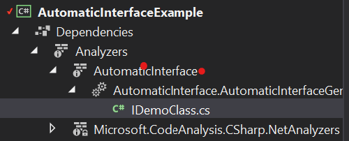

# Automatic Interface

A C# Source Generator to automatically create Interfaces from classes.

[](https://www.nuget.org/packages/AutomaticInterface/)

## What does it do?

Not all .NET Interfaces are created equal. Some interfaces are lovingly handcrafted, e.g. the public interface of your .NET package which is used by your customers. Other interfaces are far from lovingly crafted, they are birthed because you need an interface for testing or for the DI container. They are often implemented only once or twice: The class itself and a mock for testing. They are noise at best and often create lots of friction. Adding a new method / field? You have to edit the interface, too!. Change parameters? Edit the interface. Add documentation? Hopefully you add it to the interface, too!

This Source Generator aims to eliminate this cost by generating an interface from the class, without you needing to do anything.
This interface will be generated on each subsequent build, eliminating the friction.

## Example

```c#
using AutomaticInterface;
using System;

namespace AutomaticInterfaceExample
{
    /// <summary>
    /// Class Documentation will be copied
    /// </summary>
    [GenerateAutomaticInterface]
    class DemoClass: IDemoClass // Your interface will get the Name I+classname, here IDemoclass. 
    // Generics, including constraints are allowed, too. E.g. MyClass<T> where T: class
    {
        /// <summary>
        /// Property Documentation will be copied
        /// </summary>
        public string Hello { get; set; } // included, get and set are copied to the interface when public

        public string OnlyGet { get; } // included, get and set are copied to the interface when public

        [IgnoreAutomaticInterface]
        public string? AnotherGet { get; } // ignored with help of attribute

        /// <summary>
        /// Method Documentation will be copied
        /// </summary>
        public string AMethod(string x, string y) // included
        {
            return BMethod(x, y);
        }

        private string BMethod(string x, string y) // ignored because not public
        {
            return x + y;
        }

        public string CMethod<T, T1, T2, T3, T4>(string? x, string y) // included
            where T : class
            where T1 : struct
            where T3 : DemoClass
            where T4 : IDemoClass
        {
            return "Ok";
        }

        public Task<string> ASync(string x, string y)
        {
            return Task.FromResult("");
        }

        public static string StaticProperty => "abc"; // static property, ignored

        public static string StaticMethod() // static method, ignored
        {
            return "static" + DateTime.Now;
        }

        /// <summary>
        /// event Documentation will be copied
        /// </summary>

        public event EventHandler ShapeChanged;  // included

        private event EventHandler ShapeChanged2; // ignored because not public

        private readonly int[] arr = new int[100];

        public int this[int index] // currently ignored
        {
            get => arr[index];
            set => arr[index] = value;
        }
    }
}
```

This will create this interface:

```C#
#nullable enable

/// <summary>
/// Result of the generator
/// </summary>
namespace AutomaticInterfaceExample
{
    /// <summary>
    /// Class documentation will be copied
    /// </summary>
    [global::System.CodeDom.Compiler.GeneratedCode("AutomaticInterface", "")]
    public partial interface IDemoClass
    {
        /// <inheritdoc cref="AutomaticInterfaceExample.DemoClass.Hello" />
        string Hello { get; set; }
        
        /// <inheritdoc cref="AutomaticInterfaceExample.DemoClass.OnlyGet" />
        string OnlyGet { get; }
        
        /// <inheritdoc cref="AutomaticInterfaceExample.DemoClass.AMethod(string, string)" />
        string AMethod(string x, string y);
        
        /// <inheritdoc cref="AutomaticInterfaceExample.DemoClass.CMethod{T, T1, T2, T3, T4}(string?, string)" />
        string CMethod<T, T1, T2, T3, T4>(string? x, string y) where T : class where T1 : struct where T3 : global::AutomaticInterfaceExample.DemoClass where T4 : IDemoClass;
        
        /// <inheritdoc cref="AutomaticInterfaceExample.DemoClass.ASync(string, string)" />
        global::System.Threading.Tasks.Task<string> ASync(string x, string y);
        
        /// <inheritdoc cref="AutomaticInterfaceExample.DemoClass.ShapeChanged" />
        event global::System.EventHandler ShapeChanged;
        
        /// <inheritdoc cref="AutomaticInterfaceExample.DemoClass.ShapeChangedNullable" />
        event global::System.EventHandler? ShapeChangedNullable;
        
        /// <inheritdoc cref="AutomaticInterfaceExample.DemoClass.ShapeChangedNullable2" />
        event global::System.EventHandler<string?> ShapeChangedNullable2;
        
    }
}
#nullable restore
```

## How to use it?

1. Install the nuget: `dotnet add package AutomaticInterface`.
2. Add `using AutomaticInterface;` or (Pro-tip) add `global using AutomaticInterface;` to your GlobalUsings.
3. Tag your class with the `[GenerateAutomaticInterface]` attribute.
4. The Interface should now be available.

To validate or use the interface:

1. Let your class implement the interface, e.g. `SomeClass: ISomeClass`
2. 'Go to definition' to see the generated interface.
3. Build Solution to compile the interface.

Any errors? Ping me at: christiian.sauer@codecentric.de

## Troubleshooting

### How can I see the Source code?

Newer Visual Studio Versions (2019+) can see the source code directly:



Alternatively, the Source Generator generates a log file - look out for a "logs" folder somewhere in bin/debug/... OR your temp folder /logs. The exact location is also reported on Diagnosticlevel Info.

### I have an error

Please create an issue and a minimally reproducible test for the problem. 

PRs are welcome!
Please make sure that you run [CSharpier](https://csharpier.com/) on the code for formatting.

## Contributors

- Thanks to [dnf](https://dominikjeske.github.io/) for creating some great extensions. I use them partially in this Generator. Unfortunately due to problems referencing packages I cannot depend on his packages directly.
- skarllot for PRs
- Frederik91 for PRs
- definitelyokay for PRs
- roflmuffin for PRs
- mohummedibrahim  for code and idea
- simonmckenzie for PRs
- avtc for PR
- crwsolutions for PRs
- FinnAngelo for PR
- mtren for PR
- ChaseFlorell for PR

## Run tests

Should be simply a build and run Tests
Note that we use [Verify](https://github.com/VerifyTests/Verify) for testing. It's recommended that you use te Verify plugin for your UI.

## Changelog

### 5.2.0

- Allow internal interfaces. Thanks mtren!
- Add support for custom interface names. Thanks ChaseFlorell!

### 5.1.4

- Emit fully qualified type constraints on generic interfaces

### 5.1.3

- Emit `notnull` type constraints on generic type parameters

### 5.1.2

- Fixing enums in method signatures
  
### 5.1.1

- Emit `new()` type constraints on generic type parameters; emit `params` keyword for method parameters. Thanks, @simonmckenzie!

### 5.1.0

- Improves inheritdoc so that developer documentation is properly referenced on the autogenerated interfaces. Thanks, CFlorell!

### 5.0.3

- Query members only once. Small optimization. Thanks, @crwsolutions!

### 5.0.2

- Fully qualify type references; remove usings. Thanks, @simonmckenzie!

### 5.0.1

- Sync DemoClass and actual generated code with README. Thanks, @crwsolutions!
- Removed manual attribute in TestNuget project. Thanks, @crwsolutions!

### 5.0.0

- 4.0.0 changed how parameters where qualified - this PR changes it to using qualified names everywhere because 4.0.0 broke lots of stuff. Thanks for your contributions! Especially simonmckenzie for the hard work and realbart for bringing it up

### 4.1.0

- Adds ability to use `init` in property setters

### 4.0.0

- Breaking change in how generated code qualifies parameters, e.g. `async Task` should no longer generated as `System.Threading.Task`. I hope this does not break things
- Completely overhauled test suite - fixed lots of code issues and tightened checks so that errors now surface when testing-
- Applied fixes for overriding and shadowing also for events. Thanks FinnAngelo!

### 3.0.1

- Maintenance update. Use of `ForAttributeWithMetadataName` to improve performance. Thanks crwsolutions!

### 3.0.0

- You can remove the manually created `GenerateAutomaticInterfaceAttribute`, as it is generated automatically now. Thanks crwsolutions!
- You can remove the manually created `IgnoreAutomaticInterfaceAttribute`, as it is generated automatically now. Thanks crwsolutions!

### 2.50.
- Now can ignore class members with [IgnoreAutomaticInterface] attribute. Thanks avtc!

### 2.40.
- Now prevents duplicates when overriding or shadowing methods (`new void DoSomething()`). Thanks simonmckenzie!

### 2.3.0

- Now supports methods with `ref / in / out` parameters. Thanks mohummedibrahim
- Handles default values for `true / false` correctly. Thanks simonmckenzie!

### 2.2.1

- Now supports Interfaces containing `new`, previously duplicates entries where created
- Now supports `ref` parameters
- Now supports properties with reserved names like `@event`

### 2.1.1

- Fix bug where multiple automatic interfaces caused issues
- Better support for nullable like Task<string?>, previously only top level generic where considered

### 2.0.0

- Major rework to Incremental Source generator
- Fixed some outstanding bugs
- Removed logging, b/c not really used
- Increased coverage

### 1.6.1

 - Minor bug fixes

### 1.5.0

 - Add support nullable context

### 1.4.0

 - Add support for overloaded methods.
 - Add support for optional parameters in method `void test(string x = null)` should now work.
